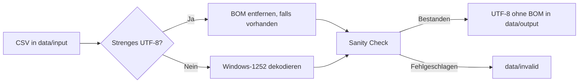
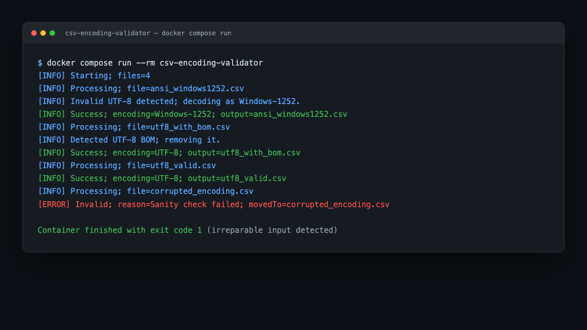

# CSV Encoding Validator & Converter

[](https://learn.microsoft.com/powershell/)
[](https://www.docker.com/products/docker-desktop/)
[](LICENSE)

Automatisierbarer CSV-Validator und Konverter für PowerShell 7 und Docker. Das Tool erkennt fehlerhafte oder unerwartete Zeichencodierungen, konvertiert Windows-1252-Dateien sicher nach UTF-8 ohne BOM und verschiebt nicht sicher reparierbare Dateien in ein separates Verzeichnis.

## Warum dieses Projekt?

Microsoft Excel speichert CSV-Dateien je nach Version und Workflow häufig als Windows-1252/ANSI. Deutsche Umlaute, `ß`, das Eurozeichen und weitere Zeichen können dadurch beim automatisierten Import beschädigt werden. Dieses Tool prüft die Bytes vor dem Import und erzeugt ein einheitliches UTF-8-Zielformat.

## Funktionen

- Strikte byteweise UTF-8-Validierung
- Erkennung und Entfernung einer UTF-8-BOM
- Windows-1252-Fallback für typische Excel-CSV-Dateien
- Sanity Check auf `U+FFFD` und typische Double-Encodings wie `ä`
- Atomisches Schreiben der Ausgabedateien
- Schutz vor dem Überschreiben vorhandener Dateien durch eindeutige Suffixe
- Detailliertes Standard-Out-Logging pro Datei
- Exit-Code `0` bei vollständig erfolgreicher Verarbeitung, `1` bei mindestens einem irreparablen Fehler
- Einmaliger, isolierter Docker-Lauf ohne dauerhaft laufenden Dienst

## Ablauf im Überblick



## Screenshot

Beispiel eines erfolgreichen Containerlaufs mit UTF-8-, BOM- und Windows-1252-Dateien sowie einer abgewiesenen korrupten Datei:



## Voraussetzungen

- Docker Desktop mit Docker Compose
- PowerShell 7 nur für den lokalen Testlauf
- macOS, Linux oder Windows mit funktionierendem Docker-Volume-Mount

## Verwendung mit Docker Compose

```bash
mkdir -p data/input data/output data/invalid

# CSV-Dateien nach data/input kopieren
cp meine-datei.csv data/input/

docker compose build
docker compose run --rm csv-encoding-validator
```

Der Container verarbeitet alle Dateien mit der Endung `.csv`, schreibt erfolgreiche Ergebnisse nach `data/output` und verschiebt irreparable Dateien nach `data/invalid`. Erfolgreiche Eingabedateien bleiben als Original im Eingangsverzeichnis erhalten.

## Verwendung mit `docker run`

```bash
docker build -t csv-encoding-validator .
docker run --rm \
  -v "$PWD/data/input:/app/data/input" \
  -v "$PWD/data/output:/app/data/output" \
  -v "$PWD/data/invalid:/app/data/invalid" \
  csv-encoding-validator
```

## Verzeichnisse

```text
data/input    zu prüfende CSV-Dateien
data/output   valide und konvertierte UTF-8-Dateien ohne BOM
data/invalid  nicht sicher reparierbare CSV-Dateien
docs/         Projektdokumentation und Screenshot
src/          PowerShell-Produktionsskript
tests/        reproduzierbare Tests
```

## Logging und Exit-Codes

Das Skript protokolliert Start, Erkennung, Konvertierung, Sanity Check, Erfolg und Fehler auf Standard-Out. Der Container endet nach der Verarbeitung:

| Code | Bedeutung |
| ---: | --- |
| `0` | Alle CSV-Dateien sind valide oder wurden erfolgreich konvertiert. |
| `1` | Mindestens eine Datei konnte nicht sicher verarbeitet werden und liegt in `data/invalid`. |

## Lokale Tests

Die Testfälle werden bytegenau zur Laufzeit erzeugt; ein externes Testframework ist nicht erforderlich:

```bash
pwsh -NoLogo -NoProfile -File ./tests/run-tests.ps1
```

Die Tests decken gültiges UTF-8, UTF-8 mit BOM, Windows-1252 mit Umlauten und eine absichtlich beschädigte Datei ab.

## Technische Details

Das Produktionsskript ist [`src/Test-AndFixCsvEncoding.ps1`](src/Test-AndFixCsvEncoding.ps1). Es verwendet explizite .NET-Encodings und keine PowerShell-Defaults für Datei-I/O. UTF-8 wird mit `UTF8Encoding($false, $true)` strikt und ohne BOM geschrieben. Bestehende Dateien im Zielverzeichnis werden nicht überschrieben; bei Namenskonflikten entsteht beispielsweise `datei_1.csv`.

## Projekt lokal bauen

```bash
docker compose build
docker compose run --rm csv-encoding-validator
```

Das Projekt ist für einen einmaligen Batch-Lauf ausgelegt und beendet sich nach der Verarbeitung selbst.

## Lizenz

Dieses Projekt steht unter der MIT-Lizenz. Siehe [`LICENSE`](LICENSE).
