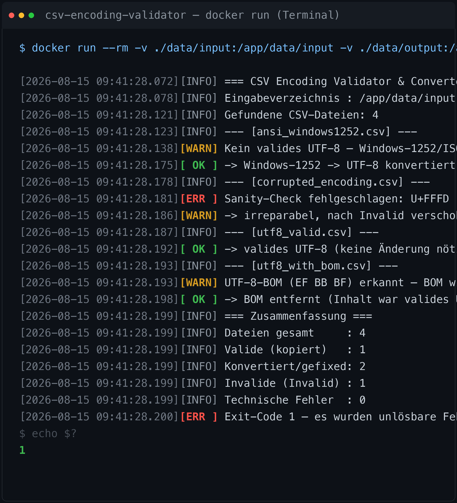

# CSV Encoding Validator & Converter (Docker & PowerShell 7)

[](https://learn.microsoft.com/powershell/)
[](https://www.docker.com/products/docker-desktop/)
[](LICENSE)

Automatisierbares Tool, das CSV-Dateien aus einem Eingangsverzeichnis analysiert,
deren Zeichenkodierung prüft und sicherstellt, dass sie in sauberem **UTF-8
(ohne BOM)** vorliegen.

**Hintergrund:** Excel speichert CSV-Dateien beim Öffnen/Speichern oft unbemerkt
als **Windows-1252 (ANSI)** oder **ISO-8859-1**. Beim automatisierten Import in
Folgesysteme führt das zu Zeichenabbruchfehlern bzw. korrupten deutschen
Umlauten (ä, ö, ü, Ä, Ö, Ü, ß). Das Tool erkennt solche Dateien und konvertiert
sie verlustfrei nach UTF-8.



*Beispiel-Lauf: `docker run` verarbeitet vier CSV-Dateien – eine Windows-1252-Datei
wird konvertiert, eine defekte Datei nach `/invalid` quarantänisiert, die
UTF-8-Datei bleibt unverändert und die BOM wird entfernt. Exit-Code 1, da eine
Datei irreparabel war.*

## Funktionsweise

Pro Datei werden diese Schritte sequenziell durchgeführt:

| Schritt | Beschreibung |
|---|---|
| 1. BOM-Analyse | UTF-8-BOM (`EF BB BF`) wird erkannt und entfernt (Ziel: UTF-8 ohne BOM). |
| 2. Heuristische UTF-8-Validierung | Byteweise Prüfung auf valide UTF-8-Multibyte-Sequenzen (strikt, inkl. Overlong-/Surrogate-Ablehnung). |
| 3. Reparatur | Invalides UTF-8 (meist Windows-1252) wird mit Codepage 1252 gelesen und als UTF-8 ohne BOM neu geschrieben. |
| 4. Integritätsprüfung (Sanity Check) | Prüfung auf `U+FFFD`-Ersetzungszeichen, NUL-Bytes und Double-Encoding/Mojibake (z. B. `ä` statt `ä`). |
| 5. Logging & Exit-Codes | Detailliertes Konsolen-Logging; Exit-Code 0 oder 1. |

**Exit-Codes**

| Code | Bedeutung |
|---|---|
| `0` | Alle Dateien valide bzw. erfolgreich konvertiert (oder keine Dateien vorhanden). |
| `1` | Unlösbare Fehler gefunden (defekte Dateien in `/invalid`, I/O-Fehler, fehlendes Eingabeverzeichnis). |

**Dateiverteilung**

- `/app/data/input` → zu prüfende CSV-Dateien
- `/app/data/output` → valide/konvertierte UTF-8-Dateien (ohne BOM)
- `/app/data/invalid` → irreparable/defekte Dateien (Quarantäne)

Defekte Dateien werden **immer** nach `/invalid` verschoben (Quarantäne).
Valide/konvertierte Dateien werden standardmäßig **kopiert** (Eingabe bleibt
unverändert, Lauf ist idempotent); mit `-Move` werden verarbeitete Dateien aus
dem Eingabeverzeichnis entfernt (verschoben bzw. nach erfolgreicher
Konvertierung gelöscht).

## Projektstruktur

```text
.
├── Dockerfile
├── docker-compose.yml
├── README.md
├── .dockerignore
├── data/                      # Volume-Quellen für docker compose
│   ├── input/
│   ├── output/
│   └── invalid/
├── src/
│   └── Test-AndFixCsvEncoding.ps1
├── img/
│   └── screenshot.png            # Beispiel-Lauf (Screenshot oben)
├── tests/
│   ├── run-tests.ps1
│   └── testdata/
│       ├── utf8_valid.csv         (Soll-Pass)
│       ├── utf8_with_bom.csv      (Soll-Fix)
│       ├── ansi_windows1252.csv   (Soll-Fix)
│       └── corrupted_encoding.csv (Soll-Fail)
└── tools/
    └── regen-testdata.py          # regeneriert die binären Fixtures
```

## Schnellstart

### 1. Image bauen

```bash
docker build -t csv-encoding-validator:latest .
```

### 2. Dateien ablegen

CSV-Dateien nach `data/input/` kopieren (oder ein anderes Verzeichnis mounten).

### 3. Verarbeiten (docker compose)

```bash
# Exit-Code wird sauber durchgereicht (0 = ok, 1 = Fehler):
docker compose run --rm csv-encoding-validator
echo "Exit-Code: $?"

# Alternativ als Einmal-Job:
docker compose up --build
```

### 4. Verarbeiten (docker run mit eigenen Verzeichnissen)

```bash
docker run --rm \
  -v "$PWD/data/input:/app/data/input" \
  -v "$PWD/data/output:/app/data/output" \
  -v "$PWD/data/invalid:/app/data/invalid" \
  csv-encoding-validator:latest
echo "Exit-Code: $?"
```

Parameter können direkt angehängt werden (werden an das Skript durchgereicht):

```bash
docker run --rm -v "$PWD/in:/app/data/input" -v "$PWD/out:/app/data/output" -v "$PWD/bad:/app/data/invalid" \
  csv-encoding-validator:latest -Move
```

## Skript-Parameter

```powershell
pwsh -File src/Test-AndFixCsvEncoding.ps1 [-InputDir <Pfad>] [-OutputDir <Pfad>] [-InvalidDir <Pfad>] [-Move]
```

| Parameter | Default | Beschreibung |
|---|---|---|
| `-InputDir` | `/app/data/input` | Verzeichnis mit den zu prüfenden CSV-Dateien. |
| `-OutputDir` | `/app/data/output` | Ziel für valide/konvertierte UTF-8-Dateien. |
| `-InvalidDir` | `/app/data/invalid` | Quarantäne für irreparable Dateien. |
| `-Move` | aus | Verarbeitete Dateien aus dem Eingabeverzeichnis entfernen (valide: verschieben, konvertiert: Original nach dem Schreiben löschen). |

Es werden nur Dateien mit der Endung `.csv` (case-insensitiv, nicht rekursiv)
verarbeitet. Fehlende Ausgabe-/Invalid-Verzeichnisse werden automatisch angelegt.

## Tests

Die Test-Suite führt das Skript in vier Phasen gegen die Fixtures aus
`tests/testdata/` aus (Exit-Codes, Byte-Identität, BOM-Entfernung,
1252→UTF-8-Konvertierung, Quarantäne der korrupten Datei, leere Datei,
Move-Modus):

```bash
# Lokal (PowerShell 7 erforderlich):
pwsh -NoProfile -File tests/run-tests.ps1

# Im Container (tests/ wird per Volume gemountet):
docker run --rm --entrypoint pwsh -v "$(pwd):/app" -w /app \
    csv-encoding-validator:latest -NoProfile -File /app/tests/run-tests.ps1
```

Die binären Fixtures können jederzeit neu erzeugt werden:

```bash
python3 tools/regen-testdata.py
```

## Heuristik & Grenzen (wichtig)

- **Windows-1252 vs. ISO-8859-1:** Für deutsche Umlaute sind beide Codepages
  identisch; das Tool dekodiert mit Windows-1252 (Codepage 1252). Dateien, die
  in ISO-8859-1 gespeicherte Steuerzeichen (0x80–0x9F) enthalten, werden wie
  1252 interpretiert – im CSV-Kontext praktisch irrelevant.
- **Echtes UTF-8 kann keine 1252-Kodierung enthalten und umgekehrt:** Bytes wie
  `0xE4` (ä) sind als UTF-8 niemals gültig, daher ist die Unterscheidung für
  Umlaute eindeutig.
- **Mojibake-Detektion ist heuristisch:** Das Muster `Ã/Â` + Latin-1-Zeichen
  kann in exotischen, aber legitimen Texten theoretisch falsch-positiv sein.
  Dateien mit `U+FFFD` oder NUL-Bytes (UTF-16 ohne BOM) gelten grundsätzlich
  als irreparabel → `/invalid`.
- **UTF-16/UTF-32 (mit BOM)** werden nicht unterstützt und landen in `/invalid`.
- Dateien werden vollständig in den Speicher gelesen – für sehr große Dateien
  entsprechend RAM einplanen.

## Beispiel-Log

```
[2026-08-15 11:40:00.000][INFO] === CSV Encoding Validator & Converter ===
[2026-08-15 11:40:00.000][INFO] Eingabeverzeichnis : /app/data/input
...
[2026-08-15 11:40:00.001][INFO] --- [ansi_windows1252.csv] ---
[2026-08-15 11:40:00.001][WARN] Kein valides UTF-8 – Windows-1252/ISO-8859-1 vermutet, Reparatur wird versucht.
[2026-08-15 11:40:00.003][ OK ] -> Windows-1252 -> UTF-8 konvertiert; als UTF-8 ohne BOM geschrieben: /app/data/output/ansi_windows1252.csv
[2026-08-15 11:40:00.003][INFO] === Zusammenfassung ===
...
[2026-08-15 11:40:00.004][ OK ] Exit-Code 0 – alle Dateien valide bzw. erfolgreich konvertiert.
```

## Lizenz

MIT — siehe [LICENSE](LICENSE).
